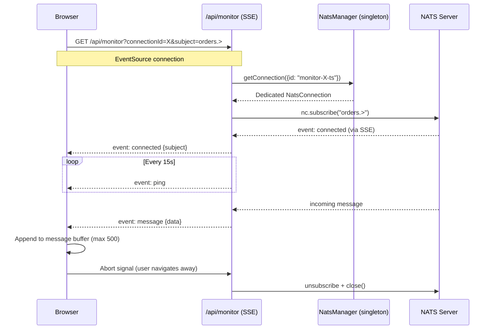
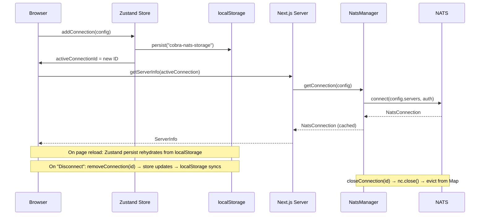
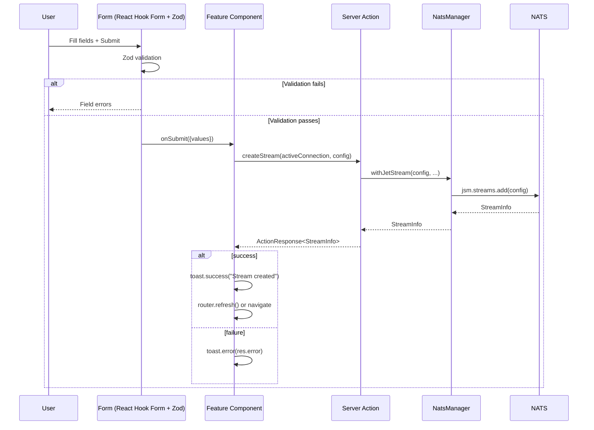
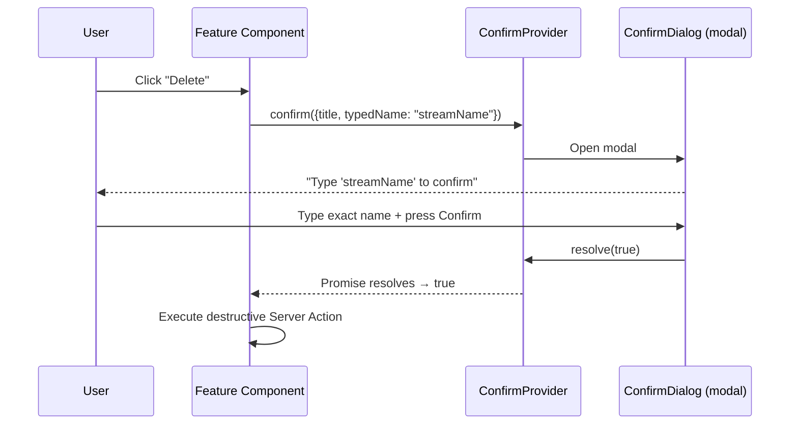

# Data Flows

## Primary flow: Feature operation (e.g., "list streams")

```mermaid
sequenceDiagram
    participant Browser
    participant NextServer as Next.js Server
    participant NatsMgr as NatsManager (singleton)
    participant NATS as NATS Server

    Browser->>NextServer: listStreams(config)
    Note over Browser,NextServer: Server Action (RPC)
    NextServer->>NatsMgr: getConnection(config)
    NatsMgr-->>NextServer: NatsConnection (cached or new)
    NextServer->>NatsMgr: getJetStreamManager(config)
    NatsMgr-->>NextServer: JetStreamManager (cached or new)
    NextServer->>NATS: jsm.streams.list()
    NATS-->>NextServer: StreamInfo[] (iterator)
    NextServer-->>Browser: ActionResponse<StreamInfo[]>
    Browser->>Browser: if (!res.success) toast.error(); else render
```

## SSE flow: Live subject monitor



## Connection lifecycle



## Form submission flow (e.g., "create stream")



## Confirm dialog flow (destructive actions)


