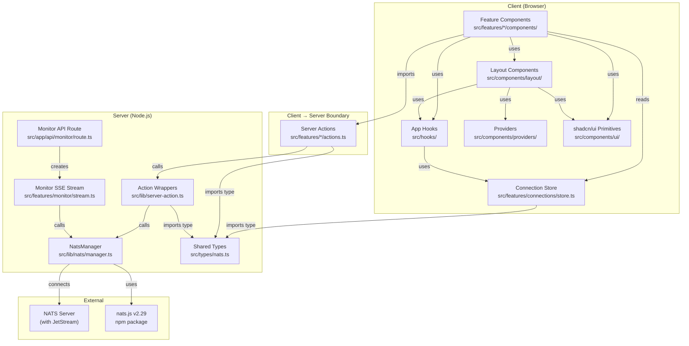

# Global Dependencies

## Dependency graph (Mermaid)

## External dependencies (npm)

| Package | Version | Purpose | Used in |
|---|---|---|---|
| `nats` | ^2.29.3 | Core NATS client (server-side only) | `lib/nats/manager.ts`, all `actions.ts`, `monitor/stream.ts` |
| `next` | 16.2.7 | Framework (App Router) | Entire app |
| `react` / `react-dom` | 19.2.7 | UI framework | All `*.tsx` components |
| `zustand` | ^5.0.14 | State management | `features/connections/store.ts` |
| `@tanstack/react-table` | ^8.21.3 | Data table logic | Stream table (`stream-table.tsx`) only |
| `react-hook-form` + `zod` + `@hookform/resolvers` | ^7.78.0 / ^4.4.3 / ^5.4.0 | Form validation | All forms (stream create, KV put, publish, etc.) |
| `sonner` | ^2.0.7 | Toast notifications | All client components post-action |
| `lucide-react` | ^1.17.0 | Icon library | All UI components |
| `cmdk` | ^1.1.1 | Command palette | `components/layout/command-palette.tsx` |
| `next-themes` | ^0.4.6 | Dark/light mode | `providers/root-provider.tsx` |
| `tailwind-merge` + `clsx` | ^3.6.0 / ^2.1.1 | CSS class merging | `lib/utils.ts` (`cn()`) |
| `class-variance-authority` | ^0.7.1 | Variant-based component styling | shadcn/ui components |
| `date-fns` | ^4.4.0 | Date formatting | Various UI components |
| `marked` | ^18.0.5 | Markdown rendering | Help/popup content |
| `shiki` | ^4.2.0 | Syntax highlighting | `components/ui/code-viewer.tsx` |

## Internal dependency rules

- **`src/features/<domain>/actions.ts`** → depends on `lib/server-action.ts`, `lib/nats/manager.ts` (transitively), `types/nats.ts`
- **`src/features/<domain>/components/*`** → depends on same-domain `actions.ts`, `features/connections/hooks.ts`, `components/ui/*`, `hooks/*`
- **`src/features/connections/store.ts`** → depends only on `types/nats.ts` and `zustand` (the root of all state)
- **`src/app/(dashboard)/**/*.tsx`** → depends on layout components + feature components (thin routing layer)
- **`src/components/layout/*`** → depends on `components/ui/*`, `features/connections/`, `hooks/*`
- **`src/components/providers/*`** → depends on `components/ui/*`, `next-themes`, `sonner`
- **`src/lib/*`** → depends only on `types/nats.ts` and `nats` package; NEVER imports from `features/` or `components/`
- **`src/types/nats.ts`** → zero dependencies (pure types, no imports)
